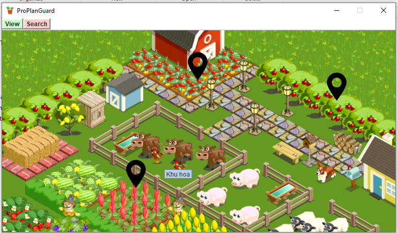
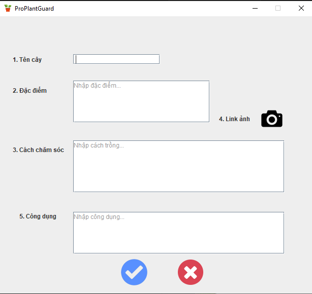
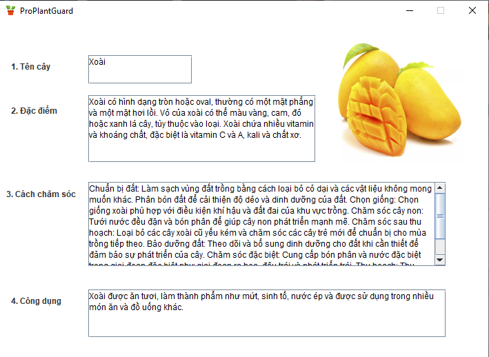
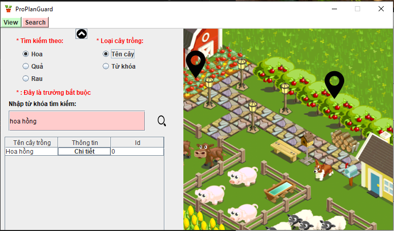

# [ProPlantGuard]
- Bài tập cuối khóa Java Core của CLB Lập Trình PTIT.
- Tên dự án: ProPlantGuard.
- Mô tả: **ProPlantGuard**  là một ứng dụng trên nền tảng máy tính (desktop app) sử dụng Java Swing Đây là một ứng dụng theo dõi cây trồng tương tự như một cuốn nhật kí ghi lại những thông tin chi tiết về từng loại cây cũng như giai đoạn phát triển, đồng thời cũng đưa ra gợi ý về loại cây theo nhu cầu của người dùng.

## Authors
- [@thm_scor](https://github.com/thm1911)

## Demo
Linh video:
>[ProPlantGuard](https://www.youtube.com/watch?v=jeQwhe2vIyM)

## ScreenShots







## Features
Các chức năng chính của ứng dụng: 
- Xem thông tin chi tiết của từng loại cây trồng (Tên, Đặc điểm Hình ảnh, Cách trồng cây, Công dụng).
- Thêm cây (Thêm những hiểu biết về loại cây tìm được).
- Xóa cây (Xóa cây trồng cảm thấy nó không phù hợp với mục đích).
- Tra cứu cây trồng (Theo tên hoặc theo gợi ý về đặc điểm, công dụng, cách trồng).

## Requirements
- Java 11

## Installation
```
- Clone dự án
- Chạy ứng dụng
```


